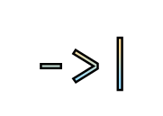

<div align="center">
  <a href="https://github.com/95jonpet/pjsh">
    
  </a>
  <h3 align="center">PJSH</h3>
  <p align="center">
    A perfectly justified shell for the modern age.
  </p>
</div>

## About The Project


_PJSH_ is a shell that aims to make the shell easier and more predictable to use. The syntax is mostly kept from the [POSIX Shell Specification](https://pubs.opengroup.org/onlinepubs/9699919799/utilities/V3_chap02.html), but legacy implementation details are removed in order to increase the readability and usability of shell scripts.

PJSH does not require heavy quoting around arguments as splitting is never done implicitly. If it looks like a word in code, it is also a word after expanding variables.

There is also support for multiline strings in which leading whitespace is trimmed in a sensible manner. This means that text indentation is not ruined in the same way as with the [heredoc](https://en.wikipedia.org/wiki/Here_document) seen in POSIX shells.

PJSH is designed to satisfy the following requirements:

- Command execution is predictable.
- Shell scripts are readable.
- The shell is not locked to a specific operating system.

## Built With

PJSH is built using the following software:

- [Rust](https://www.rust-lang.org/)
- [FPM](https://github.com/jordansissel/fpm)
- [Docker](https://www.docker.com)
- [Jenkins](https://www.jenkins.io)

## Getting Started

PJSH can be run locally using [cargo](https://doc.rust-lang.org/stable/cargo).

```bash
# Clone the repository.
git clone https://github.com/95jonpet/pjsh.git

# Compile and run PJSH from the source code.
cargo run
```
